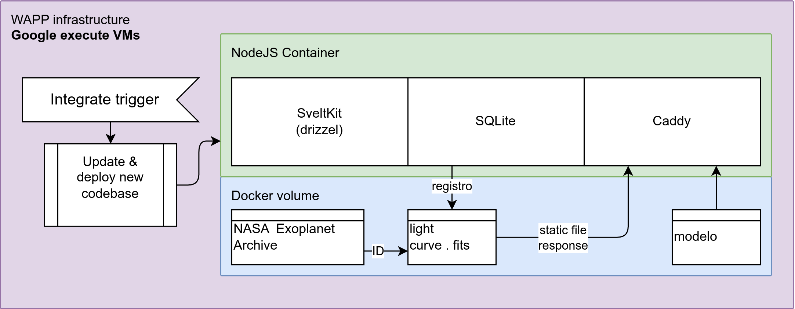
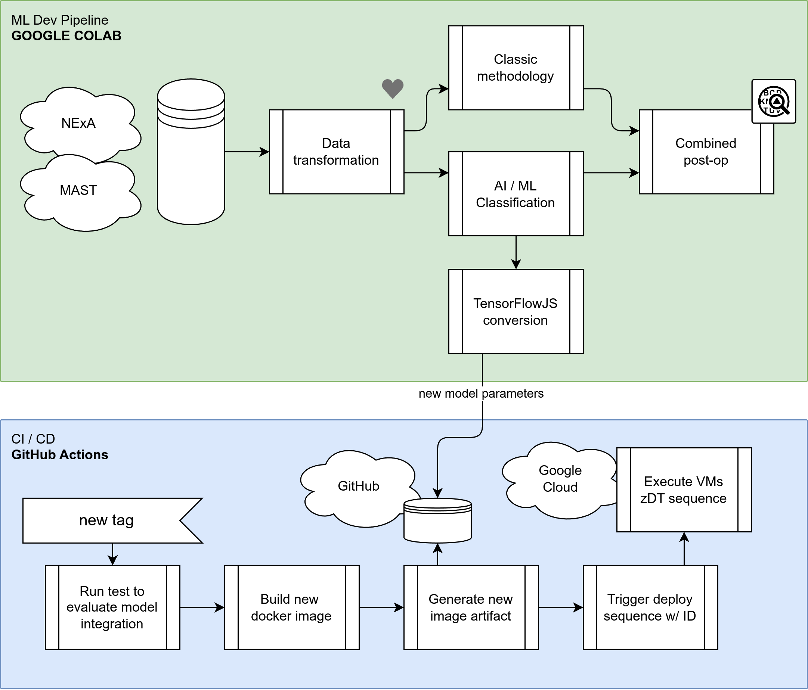

# ECHO: Exoplanet Classification Hub - Online
### 2025 NASA Space Apps Challenge

---

## 🔭 Overview

Welcome to **ECHO**, your hub for classifying exoplanets! This project is engineered to deliver a fast, efficient, and seamless user experience, from data processing to the web interface.

Our architecture is built on a modern, unified technology stack that prioritizes simplicity, performance, and maintainability. Here’s a breakdown of the core components that power ECHO:

- **🌐 Web Framework: SvelteKit**
  - We use **SvelteKit**, a powerful meta-framework built on **Node.js**, to handle everything from routing and server-side logic to rendering a highly responsive user interface.
  - The entire backend is powered by **TypeScript**, creating a unified language stack that simplifies development and deployment. The result is a production-ready application, optimized for speed.

- **🗃️ Data Layer: SQLite**
  - For our data needs, we rely on **SQLite**, a lightweight, file-based database that runs directly on the server alongside the application.
  - This choice eliminates the complexity of managing a separate database server, making our project highly portable and easy to deploy as a single, cohesive unit. It's the perfect fit for projects that value simplicity and low-overhead maintenance.

- **🛡️ Public-Facing Server: Caddy**
  - **Caddy** is the glue that holds our public-facing services together. It serves two critical functions:
    1.  **Static Server**: Efficiently delivers large static assets, such as `.fits` files, directly to the user.
    2.  **Reverse Proxy**: Forwards all API and server-side requests to our Node.js/SvelteKit application, ensuring smooth communication.
  - By separating these concerns, Caddy handles demanding tasks like **SSL/TLS termination** and **load balancing** with ease, guaranteeing security and fast response times while our SvelteKit server focuses purely on application logic.

---

## 🚀 Project Pipeline

Our architecture seamlessly integrates a sophisticated **Machine Learning Development Pipeline** with a robust **Production CI/CD Process**. This ensures that our models are not only accurate but also deployed efficiently and reliably.

### ML Development
The ML pipeline, hosted in **Google Colab**, is where the magic begins:
- **Data Sourcing & Transformation**: We pull data from official sources like **NExA/MAST** and transform it for analysis.
- **Parallel Classification**: The data is processed through two parallel streams, **Classic** and **AI/ML Classification**, before the results are merged.
- **TensorFlow.js Conversion**: The final, trained model is converted into **TensorFlow.js** format. This crucial step extracts the deployable parameters that feed directly into our CI/CD pipeline.
- Code: Add repo link here→https://github.com/apsgois/NSAC2025-ML

### CI/CD and Deployment
Once the model is ready, our automated deployment process, managed by **GitHub Actions**, takes over. Triggered by a new tag, the pipeline executes the following steps in sequence:
1.  **Integration Testing**: We run a suite of tests to validate the new model and ensure it integrates smoothly with the existing codebase.
2.  **Build Docker Image**: A new, optimized Docker image is built, containing the updated application and the new model.
3.  **Generate Cloud-Ready Artifact**: The Docker image is packaged into a cloud-ready artifact.
4.  **Push to Google Cloud**: The artifact is pushed to **Google Cloud**, ready for deployment.
5.  **Production Rollout**: Finally, a unique deployment sequence moves the validated artifact into the production environment, making the new model available to users worldwide.
